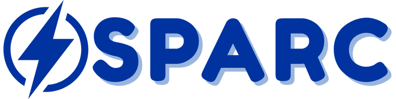

<!-- Banner Image -->
<p align="center">
  
</p>

# SPARC: Savings and Power Analysis Reporting Calculator

**Smart Energy Tracking Made Simple**

SPARC is a modern, interactive web app for calculating and visualizing your electricity bill, inspired by Meralco's branding. It helps users estimate energy consumption and costs for single or multiple appliances, empowering smarter energy use and savings.

---

## Features
- ⚡ **Single & Multiple Appliance Calculators**
- 📊 **Interactive Charts & Visualizations**
- 🏠 **Appliance Presets & Custom Inputs**
- 💸 **Cost Breakdown (Daily, Weekly, Monthly)**
- 🎨 **Modern UI with Animated Electricity Effects**
- 📱 **Responsive & Mobile-Friendly**
- 🔄 **Smooth Animations & Transitions**

## Tech Stack
- [React](https://react.dev/) + [Vite](https://vitejs.dev/)
- [Tailwind CSS](https://tailwindcss.com/) (custom Meralco-inspired palette)
- [Chart.js](https://www.chartjs.org/) for data visualization
- [React Hook Form](https://react-hook-form.com/) for forms
- [React Icons](https://react-icons.github.io/react-icons/)

## How It Works
1. **Choose Appliance(s):** Select from presets or enter custom wattage.
2. **Set Usage:** Input hours/day and days/week for each appliance.
3. **Enter Rate:** Provide your electricity rate (₱/kWh).
4. **Calculate:** Instantly see your estimated energy use and cost, with breakdowns and charts.

## Getting Started
1. **Install dependencies:**
   ```bash
   npm install
   ```
2. **Run the app locally:**
   ```bash
   npm run dev
   ```
3. **Open in browser:**
   Visit [http://localhost:####](http://localhost:####)

## Project Structure
- `src/components/` – UI and calculator components
- `src/assets/` – Images and icons
- `src/data/` – Appliance presets
- `src/utils/` – Calculation logic

## Roadmap
- User accounts & saved calculations
- Usage history & comparison
- Personalized energy-saving tips
- Dark mode
- AI chatbot for electricity questions

---

© 2024 SPARC. Developed by Jansen Moral
